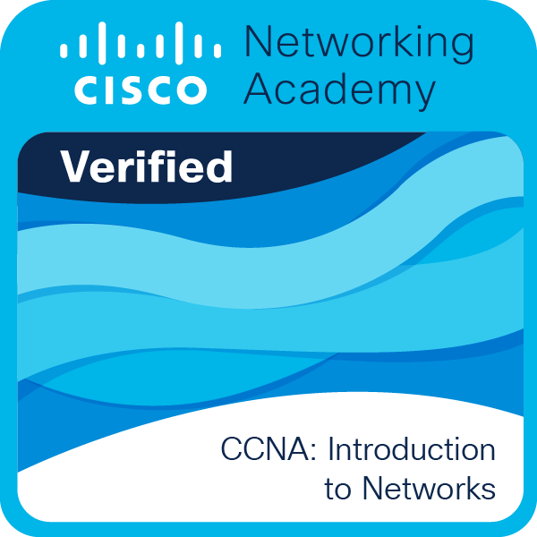

# Hi, I'm Bima Gusto Mahatsafa

---

## About Me

🎓 Student at **SMK Telkom Malang**, majoring in **Teknik Komputer dan Jaringan (TKJ)**

💻 I enjoy learning how systems work, solving problems, and documenting my progress in networking, Linux, and cybersecurity through hands-on practice — especially CTF challenges.

---

## 📖 Currently Learning

**Linux & Networking**
- Linux command line (Kali Linux, WSL)
- TCP/IP, IPv4/IPv6, Subnetting
- Switching & Routing fundamentals

**Programming & Tools**
- Python — writing clean, readable code
- Git & GitHub — version control workflows

**Security & Forensics**
- Cybersecurity fundamentals
- CTF (Capture The Flag)
- Digital forensics
- Basic reverse engineering / binary analysis

---

## 🚀 Tech Stack

**Programming**

**Operating Systems**

  
  

**Networking & Forensics Tools**

`Wireshark` `Nmap` `ExifTool` `binwalk` `strings` `xxd` `grep` `Sleuth Kit`

**Dev Workflow**

---

## 🎯 Featured Project

### 🔐 [CTF Practice & Writeups](https://github.com/mahatsafa/ctf)

A hands-on collection of Capture The Flag challenges I'm working through to build practical skills in digital forensics, steganography, and basic security analysis — covering file forensics, binary/hex inspection, and network-related puzzles.

This is where most of my "learning by doing" happens — using tools like `binwalk`, `ExifTool`, `strings`, and `xxd` to investigate files and understand how information can be hidden, extracted, or analyzed.

<!-- [TODO] Setelah repo ctf punya README dengan tabel kategori/status per challenge, ringkas isinya di sini, contoh:
> Currently working through challenges across forensics, steganography, and misc categories.
-->

---

## 📜 Certifications

### Cisco Networking Academy — CCNA: Introduction to Networks

Completed **CCNA: Introduction to Networks**, covering fundamental networking concepts including network architecture, protocols, IP addressing, and basic networking technologies.

---

## 📊 GitHub Stats

---

## 🌎 Connect with Me

---

### "Learning Never Stops."

