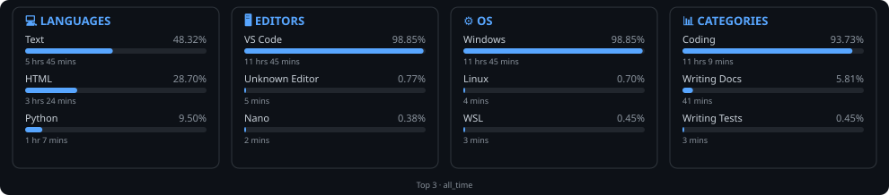
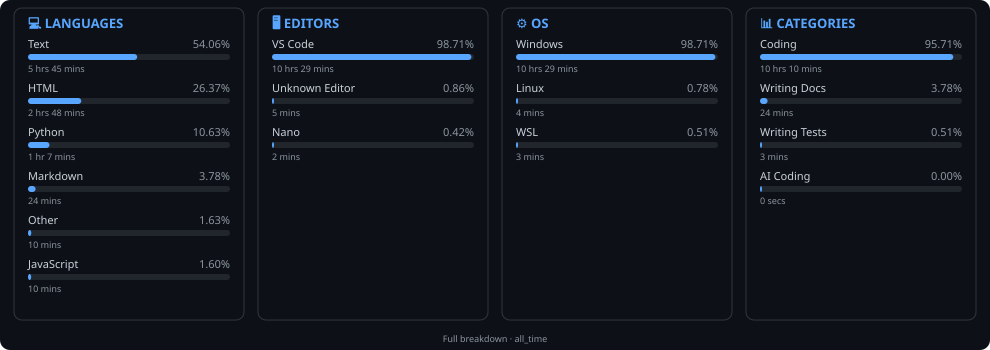

# Hi, I'm Bima Gusto Mahatsafa

---

<table width="100%">
<tr>
<td width="50%" valign="top">

## Featured Project

A collection of Capture The Flag challenges and writeups from my cybersecurity learning journey.

The repository contains hands-on practice across areas such as **digital forensics, steganography, file analysis, binary/hex inspection, and network analysis**.

I use this repository to document my problem-solving process, tools, commands, and findings while working through CTF challenges.

</td>
<td width="50%" valign="top">

## Tech Stack

**Programming**

**Operating Systems**

  
  

**Networking & Forensics Tools**

`Wireshark` `Nmap` `ExifTool` `binwalk` `strings` `xxd` `grep` `Sleuth Kit`

**Dev Workflow**

</td>
</tr>
</table>

---

<table width="100%">
<tr>
<td width="33%" valign="top">

<strong>About Me</strong>

 

Student at **SMK Telkom Malang**, majoring in **Teknik Komputer dan Jaringan (TKJ)**.

I enjoy learning how systems work, solving problems, and documenting my progress in networking, Linux, and cybersecurity through hands-on practice, especially CTF challenges.

</td>
<td width="33%" valign="top">

<strong>Currently Learning</strong>

 

### Linux & Networking
- Linux command line (Kali Linux, WSL)
- TCP/IP, IPv4/IPv6, Subnetting
- Switching & Routing fundamentals

### Programming & Tools
- Python
- Git & GitHub
- Visual Studio Code

### Security & Forensics
- Cybersecurity fundamentals
- CTF (Capture The Flag)
- Digital forensics
- Basic reverse engineering / binary analysis

</td>
<td width="34%" valign="top">

<strong>Certifications</strong>

 

<strong>Cisco Networking Academy — CCNA: Introduction to Networks</strong>

  

  

Completed **CCNA: Introduction to Networks** through Cisco Networking Academy, covering fundamental networking concepts and technologies.

</td>
</tr>

### GitHub Stats

  

  

---

### Coding Activity

  

---

Connect with Me

  

---

### Live Portfolio

<!-- PORTFOLIO_URL_START -->
[**Click here to open Portfolio →**](https://taylor-seo-bat-require.trycloudflare.com)
<!-- PORTFOLIO_URL_END -->

<i>URL updates automatically whenever the server restarts.</i>

---

### "Learning Never Stops."

