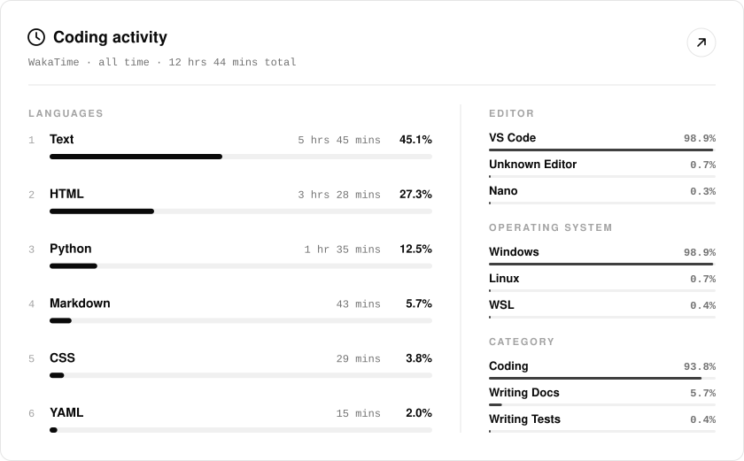
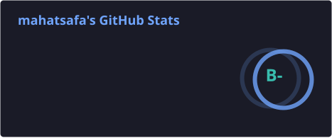
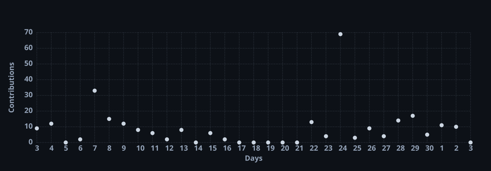

# Hi, I'm Bima Gusto Mahatsafa

---

### About Me

Student at **SMK Telkom Malang**, majoring in **Teknik Komputer dan Jaringan (TKJ)**.

I enjoy learning how systems work, solving problems, and documenting my progress in networking, Linux, and cybersecurity through hands-on practice, especially CTF challenges.

---

### Featured Projects

&nbsp;

**Portfolio** — my personal website with projects, certificates, and coding activity, live at [gustomahatsafa.vercel.app](https://gustomahatsafa.vercel.app).

**CTF Practice & Writeups** — a collection of Capture The Flag challenges and writeups from my cybersecurity learning journey. It covers hands-on practice in **digital forensics, steganography, file analysis, binary/hex inspection, and network analysis**, and documents my problem-solving process, tools, commands, and findings.

---

### Tech Stack

**Programming**

**Operating Systems**

**Networking & Forensics Tools**

`Wireshark` `Nmap` `ExifTool` `binwalk` `strings` `xxd` `grep` `Sleuth Kit`

**Dev Workflow**

---

### Digital Portfolio

See all my certifications on my portfolio:

---

<strong>Coding Activity</strong>

 

<a href="https://gustomahatsafa.vercel.app/activity">
  <picture>
    <source media="(max-width: 600px) and (prefers-color-scheme: dark)" srcset="./profile/wakatime-dark-mobile.svg">
    <source media="(max-width: 600px) and (prefers-color-scheme: light)" srcset="./profile/wakatime-light-mobile.svg">
    <source media="(prefers-color-scheme: dark)" srcset="./profile/wakatime-dark.svg">
    <source media="(prefers-color-scheme: light)" srcset="./profile/wakatime-light.svg">
    
  </picture>
</a>

---

<strong>Currently Learning</strong>

 

**Linux &amp; Networking**

Linux command line (Kali Linux, WSL) · TCP/IP, IPv4/IPv6, Subnetting · Switching &amp; Routing fundamentals

**Programming &amp; Tools**

Python · Git &amp; GitHub · Visual Studio Code

**Security &amp; Forensics**

Cybersecurity fundamentals · CTF (Capture The Flag) · Digital forensics · Basic reverse engineering

---

<strong>GitHub Stats</strong>

 

<!-- Achievements -->

  
  
  

 

  

  

---

### Connect with Me

---

### "Learning Never Stops."

